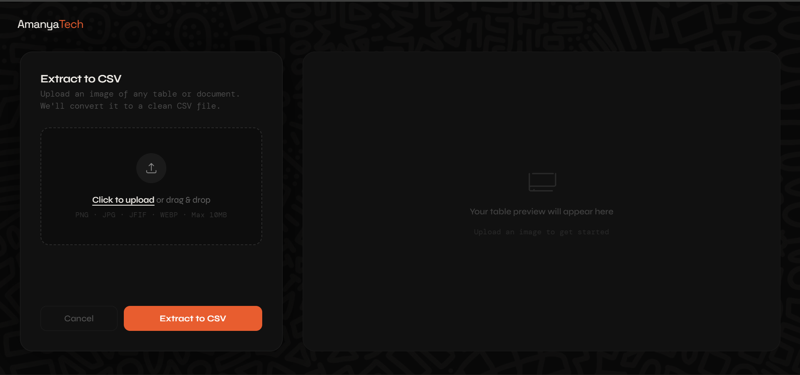
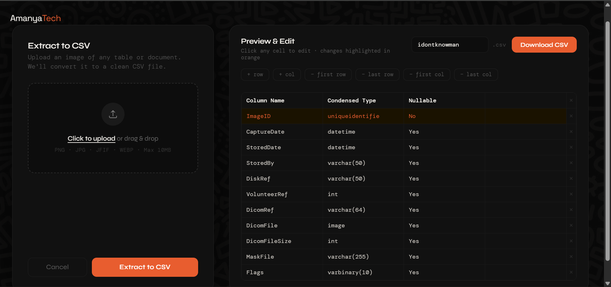

# Forma

> Document table extraction powered by AI. Upload an image, get a clean CSV.




---


## What it does

Forma lets you upload an image of any table — scanned documents, screenshots, printed reports — and converts it into a clean, editable CSV file. Instead of manually retyping data, you get a structured spreadsheet in seconds.

The pipeline uses Groq's vision AI to read the table directly from the image, with lightweight OpenCV preprocessing to handle low quality or skewed scans. Before downloading, you can edit any cell, add or remove rows and columns, and rename the output file.

---

## Features

- Drag and drop image upload
- AI-powered table extraction via Groq vision (Llama 4 Scout)
- Image preprocessing for low quality and skewed scans
- Editable table preview before download
- Add, delete first/last rows and columns
- Highlighted edited cells
- Custom CSV filename
- Dark theme UI with AmanyaTech branding

---

## Tech Stack

| Layer | Technology |
|---|---|
| Backend | Python 3.13, Django 6.0 |
| AI / Vision | Groq API (Llama 4 Scout) |
| Image Processing | OpenCV, Pillow |
| Frontend | HTML, CSS, Vanilla JS |

---

## Getting Started

### Prerequisites

- Python 3.13+
- Git
- A free [Groq API key](https://console.groq.com)

### Installation

1. Clone the repository
```bash
   git clone https://github.com/Buluma-Ke/Forma.git
   cd forma
```

2. Create and activate a virtual environment
```bash
   python -m venv .env
   .env\Scripts\activate  # Windows'
   source .env/bin/activate  # macOS/Linux
```

3. Install dependencies
```bash
   pip install -r requirements.txt
```

4. Create a `.env` file in the root folder


5. Run migrations
```bash
   python manage.py migrate
```

5. Start the development server
```bash
   python manage.py runserver
```

6. Visit `http://127.0.0.1:8000` in your browser

## Usage

1. Open the app in your browser
2. Drag and drop or click to upload an image of a table
3. Wait for AI extraction — preview appears on the right
4. Edit any cells if needed
5. Rename the file if you want
6. Click **Download CSV**

## Project Structure

```
forma/
├── documents/          # Main app — models, views, forms
│   ├── templates/
│   ├── views.py        # Upload, extraction, download logic
│   └── models.py
├── static/
│   ├── css/
│   ├── js/
│   └── images/
├── forma/              # Django project settings
├── requirements.txt
└── .env                # API keys (never commit this)
```

## Roadmap

- [ ] PDF upload support
- [ ] Async processing with Celery
- [ ] Cloud storage with S3
- [ ] REST API with Django REST Framework
- [ ] BI agent for analytics on extracted data
- [ ] Multiple export formats (Excel, JSON)
- [ ] User accounts and upload history


## Contributing

Pull requests are welcome. For major changes please open an issue first.

---


## License

MIT

---

> Built by [AmanyaTech](https://github.com/Buluma-Ke) · [Live Demo](https://forma-kqki.onrender.com)